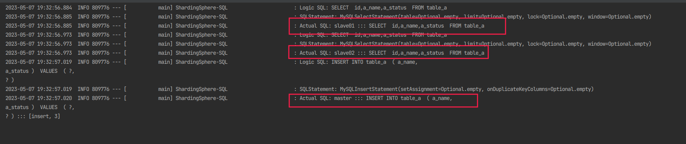

# 前提

ShardingSphere可以理解为ShardingJDBC的演进版，除了提供原有ShardingJDBC客户端级别的分库分表功能外，还提供了ShardingProxy这种中间件级别的组件（类似MyCat），接下来回顾一下ShardingJDBC的功能。

# 读写分离

```yaml
spring:
  application:
    name: demo_a
  shardingsphere:
    mode:
      type: Memory # 集群元数据使用内存存储
    datasource:
      # 这个集群的节点名称（自定义）
      names: master,slave01,slave02
      master: # 节点名称对应的数据库配置
        type: com.zaxxer.hikari.HikariDataSource
        driver-class-name: com.mysql.cj.jdbc.Driver
        jdbc-url: jdbc:mysql://192.168.120.161:3006/business_a?allowPublicKeyRetrieval=true
        username: root
        password: 123456
      slave01:
        type: com.zaxxer.hikari.HikariDataSource
        driver-class-name: com.mysql.cj.jdbc.Driver
        jdbc-url: jdbc:mysql://192.168.120.161:3005/business_a?allowPublicKeyRetrieval=true
        username: root
        password: 123456
      slave02:
        type: com.zaxxer.hikari.HikariDataSource
        driver-class-name: com.mysql.cj.jdbc.Driver
        jdbc-url: jdbc:mysql://192.168.120.161:3007/business_a?allowPublicKeyRetrieval=true
        username: root
        password: 123456
    rules:
      readwrite-splitting:
        data-sources:
          my-datasource: # 读写分离数据源的名字，可以包含上面定义的多个数据源
            type: Static
            props:
              # 写数据源
              write-data-source-name: master
              # 读数据源
              read-data-source-names: slave01,slave02
              # 读数据源的负载均衡算法名称，可以自定义
            load-balancer-name: aaa_round
        load-balancers:
          aaa_round:
            # 配置aaa_round的负载均衡算法为轮询
            type: ROUND_ROBIN
    props:
      # 打印sql
      sql-show: true
```

执行com.genn.A.ReadWriteSplitTest#readWriteSplit测试用例，发现正常读写分离，且读操作采用轮询负载均衡：

